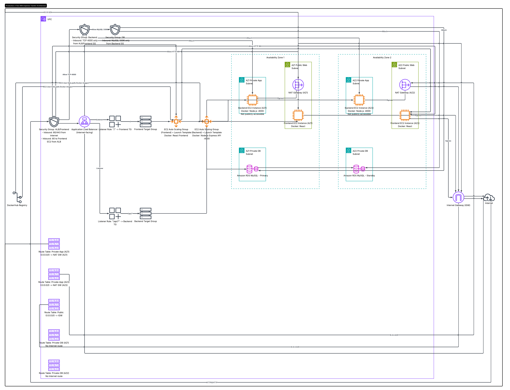

# Expense Tracker AWS — DevOps & Infrastructure as Code

[](https://react.dev/)
[](https://nodejs.org/)
[](https://www.terraform.io/)
[](https://aws.amazon.com/)
[](https://www.docker.com/)
[](https://github.com/features/actions)
[](https://docs.github.com/en/actions/deployment/security-hardening-your-deployments/configuring-openid-connect-in-amazon-web-services)
[](https://docs.aws.amazon.com/IAM/latest/UserGuide/id_roles_providers_create_oidc.html)

**Production-inspired 3-tier AWS architecture defined in Terraform** — a portfolio-grade **DevOps** project demonstrating **Infrastructure as Code**, **CI/CD**, **OIDC authentication**, and security scanning on **AWS** (`us-east-1`).

Terraform configuration is capable of provisioning the complete infrastructure stack with a single `terraform apply`. **AWS deployment validation is planned** after remote state backend implementation. **GitHub Actions** validates every Terraform PR with **TFLint**, **Checkov**, and **GitLeaks**.

**Deploy guide (when ready):** [docs/terraform-deployment.md](docs/terraform-deployment.md)

---

## Project Status

✅ Infrastructure code complete  
✅ CI/CD foundation complete  
✅ OIDC authentication complete  
✅ Security scanning complete  

⏳ Remote state backend  
⏳ CloudWatch monitoring  
⏳ SNS alerting  
⏳ HTTPS / ACM  
⏳ WAF  
⏳ AWS deployment validation  

AWS deployment validation planned after backend bootstrap phase.

---

## Key Achievements

- Authored complete **AWS** infrastructure as **Terraform** configuration (ready to apply)
- Implemented **highly available multi-subnet architecture across two Availability Zones**
- Configured **Application Load Balancer** with path-based routing (`/api/*` → backend)
- Designed **Auto Scaling Groups** (`frontend-asg`, `backend-asg`) with **Docker** on EC2
- Automated database schema initialization in application code (`bootstrap.js`)
- Implemented **GitHub Actions CI/CD** with **OIDC** passwordless AWS authentication
- Integrated **TFLint**, **Checkov**, and **GitLeaks** for IaC quality and security scanning
- Enabled **IMDSv2** on EC2 and **RDS storage encryption** in Terraform
- Designed **S3 remote state** backend with native lock files (`use_lockfile`)

---

## Project overview

This is not only an application deployment — it is a **portfolio-grade DevOps project** built to demonstrate modern cloud engineering practices:

| Area | Implementation |
|------|----------------|
| **Infrastructure as Code** | Full AWS stack in `terraform/` |
| **CI/CD** | `.github/workflows/terraform-pr.yml` |
| **Security** | Security groups, IMDSv2, RDS encryption, OIDC, secret scanning |
| **Quality gates** | Pre-commit hooks + PR pipeline (fmt, validate, TFLint, Checkov) |
| **State management** | `terraform-backend/` bootstrap design (S3 + `use_lockfile`) |
| **Application** | React frontend, Express API, RDS MySQL with auto schema bootstrap |

**Repository:** [rahul6364/Expense-Tracker-AWS](https://github.com/rahul6364/Expense-Tracker-AWS)

---

## Architecture overview

```
Internet
    │
    ▼
┌───────────────────────────────────────┐
│  Application Load Balancer (public)   │
│  /api/*  → Backend ASG :4000          │
│  /*      → Frontend ASG :80           │
└───────────────┬───────────────────────┘
                │
    ┌───────────┴───────────┐
    ▼                       ▼
┌─────────────┐     ┌─────────────┐
│ Frontend    │     │ Backend     │     Private app subnets
│ React/nginx │     │ Express API │     (NAT for egress)
│ Docker      │     │ Docker      │
└─────────────┘     └──────┬──────┘
                           │ MySQL :3306
                           ▼
                    ┌─────────────┐
                    │ RDS MySQL   │     Private DB subnets
                    └─────────────┘
```

| Tier | Stack | Placement |
|------|-------|-----------|
| **Web** | React.js + nginx in Docker | EC2 ASG, private app subnets, behind ALB |
| **App** | Node.js / Express in Docker | EC2 ASG, private app subnets |
| **Database** | Amazon RDS MySQL | Private DB subnets |

**Note:** API traffic flows **Browser → ALB → Backend** — not through frontend EC2.

Detailed Mermaid diagrams: **[docs/architecture.md](docs/architecture.md)**



---

## AWS services used

| Service | Role |
|---------|------|
| **VPC** | Custom network `10.0.0.0/16` |
| **Subnets** | Public (ALB, NAT) + private app (EC2) + private DB (RDS) |
| **Internet Gateway** | Public subnet ingress/egress |
| **NAT Gateway** | Private subnet outbound (2 AZs) |
| **Route Tables** | Public, per-AZ private app, isolated DB |
| **Security Groups** | `alb-sg`, `frontend-sg`, `backend-sg`, `rds-sg` — least privilege |
| **Application Load Balancer** | Path-based routing, target groups |
| **Auto Scaling Groups** | `frontend-asg`, `backend-asg` |
| **Launch Templates** | Ubuntu 22.04, IMDSv2, user data |
| **RDS MySQL** | Encrypted storage, private subnets (single-AZ in current config) |
| **IAM** | EC2 instance profile (SSM), GitHub Actions OIDC role |
| **Docker Hub** | Container images |

---

## Security architecture

### Network security groups

| Tier | Inbound | Source |
|------|---------|--------|
| **ALB** | HTTP 80, HTTPS 443 | Internet |
| **Frontend** | Port 80 | ALB security group only |
| **Backend** | Port 4000 | ALB security group only |
| **RDS** | MySQL 3306 | Backend security group only |

### Additional hardening

| Control | Status |
|---------|--------|
| **IMDSv2** (`http_tokens = required`) | Enabled on launch templates |
| **RDS storage encryption** | Enabled (`storage_encrypted = true`) |
| **OIDC for GitHub Actions** | No long-lived AWS access keys in GitHub |
| **GitLeaks** | Secret scanning in pre-commit + CI |
| **Checkov** | IaC security scanning (`soft_fail: true` in CI) |
| **TFLint** | Terraform linting and AWS best practices |

Deep dive: [docs/security-architecture.md](docs/security-architecture.md)

---

## CI/CD pipeline

**Workflow:** `.github/workflows/terraform-pr.yml`

**Triggers:** Pull requests that change `terraform/**`

| Stage | Tool / action |
|-------|----------------|
| 1. Checkout | `actions/checkout@v4` |
| 2. AWS credentials | OIDC via `aws-actions/configure-aws-credentials@v4` |
| 3. Format check | `terraform fmt -check` |
| 4. Init | `terraform init -backend=false` |
| 5. Validate | `terraform validate` |
| 6. TFLint init + scan | `terraform-linters/setup-tflint` |
| 7. Checkov | `bridgecrewio/checkov-action` (`soft_fail: true`) |

**Current CI state:**

| Item | Status |
|------|--------|
| Format, validate, TFLint, Checkov, GitLeaks | Active |
| `terraform plan` in CI | Temporarily disabled (remote backend not yet bootstrapped) |
| Checkov | `soft_fail: true` — findings documented with `#checkov:skip` annotations |

### GitHub Actions OIDC authentication

Most projects store `AWS_ACCESS_KEY_ID` and `AWS_SECRET_ACCESS_KEY` in GitHub secrets. This project uses **passwordless OIDC** — no long-lived credentials in the repository.

```
GitHub Actions → OIDC token → sts:AssumeRoleWithWebIdentity → IAM Role → temporary credentials
```

| AWS component | Purpose |
|---------------|---------|
| **GitHub OIDC provider** | Trust GitHub as an identity source (`token.actions.githubusercontent.com`) |
| **IAM role for Actions** | Assumed via `secrets.AWS_ROLE_ARN` |
| **Trust policy** | Restricts which repo/branch can assume the role |
| **Permission policy** | Scoped permissions for CI operations |

**Benefits:** No static keys to rotate or leak · Industry-standard auth model · Stronger security posture

**Target branch protection:** `main`

---

## Pre-commit hooks

**File:** `.pre-commit-config.yaml`

| Hook | Purpose |
|------|---------|
| `terraform_fmt` | Enforce consistent formatting |
| `terraform_validate` | Validate config (`-backend=false`) |
| `terraform_tflint` | Lint Terraform before push |
| `gitleaks` | Detect secrets and credentials locally |

Catches issues before they reach CI — faster feedback, fewer pipeline failures.

---

## Security scanning

| Tool | Purpose | Status |
|------|---------|--------|
| **TFLint** | Terraform best practices, AWS resource validation | Passing |
| **GitLeaks** | Detect secrets, API keys, credentials | Passing |
| **Checkov** | IaC security compliance | Integrated (`soft_fail: true`) |

**Checkov findings intentionally accepted** for the development/portfolio environment (documented with skip annotations):

- No WAF, HTTPS listener, or ACM certificate (planned)
- No VPC Flow Logs or ALB access logs (planned with CloudWatch phase)
- No Multi-AZ RDS (`multi_az = false`) or enhanced monitoring — planned for production phase

---

## Terraform remote state (designed)

**Bootstrap folder:** `terraform-backend/`

| Setting | Value |
|---------|-------|
| Bucket | `rahul-expense-tracker-tf-state` |
| Backend state key | `terraform-backend/terraform.tfstate` |
| App state key (planned) | `terraform/terraform.tfstate` |
| Locking | S3 native — `use_lockfile = true` (no DynamoDB) |
| Versioning + encryption | Enabled in bootstrap config |

**Current status:** Designed and documented — **not yet applied to AWS** (deferred to avoid extra resource cost during CI/security phases).

**Bootstrap workflow** (when ready):

```bash
cd terraform-backend
terraform init -backend=false
terraform apply
terraform init -migrate-state
```

Details: [terraform-backend/README.md](terraform-backend/README.md)

---

## Repository structure

```
Expense-Tracker-AWS/
├── frontend/                 # React + Vite + Tailwind + nginx
├── backend/                  # Express API + bootstrap.js
├── terraform/                # Main AWS Infrastructure as Code
│   ├── main.tf               # VPC, subnets, IGW, NAT
│   ├── route_table.tf
│   ├── security_groups.tf
│   ├── alb.tf
│   ├── asg.tf
│   ├── launch_template.tf    # IMDSv2, user data
│   ├── rds.tf                # Encrypted RDS
│   ├── iam.tf
│   ├── scripts/              # EC2 Docker bootstrap
│   └── terraform.tfvars.example
├── terraform-backend/        # S3 remote state bootstrap
├── docs/                     # Architecture, deploy, troubleshooting guides
├── .github/workflows/
│   └── terraform-pr.yml      # CI pipeline
├── .pre-commit-config.yaml   # Local quality gates
├── .gitattributes            # LF line endings for .tf, .sh, .yml
└── README.md
```

### Terraform provisions

VPC · Internet Gateway · Route Tables · Public / Private App / Private DB Subnets · Security Groups · Launch Templates · Auto Scaling Groups · Application Load Balancer · Target Groups · Listener Rules · IAM Roles · IAM Instance Profiles · RDS MySQL · Outputs

---

## Planned deployment workflow (Terraform)

When remote state and AWS validation are ready — infrastructure and application runtime in one apply (after Docker images are on Docker Hub):

```bash
# 1. Push images to Docker Hub
cd backend && docker build -t rahul6364/expense-tracker-api:latest . && docker push rahul6364/expense-tracker-api:latest
cd ../frontend && docker build --build-arg VITE_API_URL= -t rahul6364/expense-tracker-web:latest . && docker push rahul6364/expense-tracker-web:latest

# 2. Configure Terraform
cd ../terraform
cp terraform.tfvars.example terraform.tfvars   # edit db_password

# 3. Deploy
terraform init
terraform validate
terraform plan
terraform apply

# 4. Open app
terraform output application_url
```

**Full guide:** [docs/terraform-deployment.md](docs/terraform-deployment.md)

### Local development

```bash
cd backend && npm install && npm run dev    # :4000
cd frontend && npm install && npm run dev  # :5173
```

### Historical / learning path (manual AWS)

Before Terraform automation, this architecture was built step-by-step in the **AWS Console** for learning. That walkthrough is preserved — not the recommended deploy path.

→ [docs/aws-setup.md](docs/aws-setup.md)

---

## Challenges solved

| Challenge | Solution |
|-----------|----------|
| **Terraform backend bootstrap** | Bucket cannot be used before it exists → `init -backend=false` → `apply` → `init -migrate-state` |
| **InvalidClientTokenId in CI** | Migrated from static AWS keys to **GitHub OIDC** + IAM role |
| **Terraform plan in CI** | Temporarily disabled until S3 remote backend is bootstrapped |
| **Checkov false positives** | Documented accepted risks with `#checkov:skip` annotations |
| **CRLF formatting on Windows** | `.gitattributes` enforces LF for `.tf`, `.sh`, `.yml` |
| **Missing RDS table on first boot** | `bootstrap.js` — `CREATE TABLE IF NOT EXISTS` before API listens |
| **ALB path routing for API** | Empty `VITE_API_URL` — browser calls `/api/*` on same ALB host |

---

## Lessons learned

- **Public vs private subnet design** — ALB and NAT in public subnets; compute and DB isolated in private tiers
- **ALB health checks** — Match container ports and paths (`/` frontend, `/health` backend)
- **RDS connectivity** — Security groups, not CIDR rules, enforce backend-only database access
- **Terraform dependency management** — RDS endpoint injected into user data via `templatefile`
- **Infrastructure vs application provisioning** — Terraform builds the platform; user data + Docker deliver the app
- **OIDC over static credentials** — Industry-standard, rotatable, no secrets in GitHub
- **Shift-left security** — Pre-commit + CI scanning catches issues before production
- **Backend bootstrap pattern** — Application-owned schema vs manual SQL or migration tools

---

## Learning outcomes

Hands-on experience with:

**AWS** · **Terraform** · **Infrastructure as Code** · **VPC** · **Application Load Balancer** · **Auto Scaling Groups** · **RDS MySQL** · **Docker** · **Private Subnets** · **Multi-subnet HA** · **GitHub Actions** · **CI/CD** · **OIDC** · **AssumeRoleWithWebIdentity** · **IAM** · **TFLint** · **GitLeaks** · **Checkov** · **DevOps engineering practices**

---

## Screenshots

> Place your captures in `docs/images/`. See **[Screenshot Placement Checklist](#screenshot-placement-checklist)**.

### Infrastructure

| Description | Placeholder |
|-------------|-------------|
| VPC and subnets |  |
| Application Load Balancer |  |
| Healthy target groups |  |
| Listener rules |  |
| RDS instance |  |
| Auto Scaling Groups |  |
| GitHub Actions CI |  |
| Terraform apply success |  |

### Application

| Description | Placeholder |
|-------------|-------------|
| Dashboard |  |
| Transactions |  |
| Spending chart |  |

---

## API reference

| Method | Endpoint | Description |
|--------|----------|-------------|
| `GET` | `/health` | `{ "status": "ok" }` |
| `GET` | `/api/transactions` | List transactions |
| `POST` | `/api/transactions` | Create transaction |
| `DELETE` | `/api/transactions/:id` | Delete transaction |

---

## Documentation

| Document | Description |
|----------|-------------|
| [docs/README.md](docs/README.md) | Documentation index + screenshot checklist |
| [docs/architecture.md](docs/architecture.md) | VPC, NAT, SGs, Mermaid diagrams |
| [docs/terraform-deployment.md](docs/terraform-deployment.md) | Deploy guide: `init` → `destroy` |
| [docs/aws-setup.md](docs/aws-setup.md) | Historical manual Console guide |
| [docs/troubleshooting.md](docs/troubleshooting.md) | ALB, RDS, Docker, DB errors |
| [docs/security-architecture.md](docs/security-architecture.md) | Security deep dive |
| [terraform/README.md](terraform/README.md) | Terraform quick reference |
| [terraform-backend/README.md](terraform-backend/README.md) | Remote state bootstrap |

---

## Screenshot Placement Checklist

Capture from **your** AWS account and GitHub after deploy. Save under `docs/images/` with **exact filenames**.

| # | Filename | What to capture | Used in |
|---|----------|-----------------|---------|
| 1 | `architecture-diagram.png` | draw.io / Lucidchart 3-tier diagram | README, architecture.md |
| 2 | `vpc-subnets.png` | VPC → 6 subnets (2 public, 4 private) | README, architecture.md |
| 3 | `alb-overview.png` | Load Balancers → `expenses-alb` | README, troubleshooting.md |
| 4 | `alb-healthy.png` | Target groups → **healthy** targets | README, terraform-deployment.md |
| 5 | `alb-listener-rules.png` | Listener rules: `/api/*` + default | README, architecture.md |
| 6 | `rds-instance.png` | RDS → encrypted, private endpoint | README |
| 7 | `asg-instances.png` | ASGs `frontend-asg` / `backend-asg` | README |
| 8 | `github-actions-ci.png` | GitHub Actions workflow run — all steps green | README |
| 9 | `ec2-docker-ps.png` | SSM → `sudo docker ps` on backend | terraform-deployment.md |
| 10 | `app-dashboard.png` | Browser → ALB URL → dashboard | README |
| 11 | `app-transactions.png` | Transaction list with data | README |
| 12 | `app-chart.png` | Spending chart | README |
| 13 | `terraform-apply-success.png` | Terminal → successful `terraform apply` | README, terraform-deployment.md |

---

## License

Open source for portfolio and educational use.

---

## Author

- GitHub: [@rahul6364](https://github.com/rahul6364) · [Expense-Tracker-AWS](https://github.com/rahul6364/Expense-Tracker-AWS)
