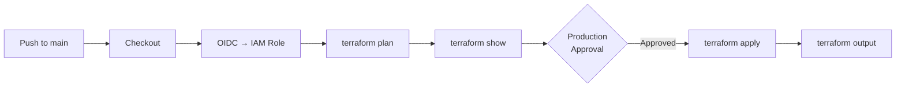

# Expense Tracker AWS — DevOps & Cloud Engineering

[](https://react.dev/)
[](https://nodejs.org/)
[](https://www.terraform.io/)
[](https://aws.amazon.com/)
[](https://www.docker.com/)
[](https://github.com/features/actions)
[](https://docs.github.com/en/actions/deployment/security-hardening-your-deployments/configuring-openid-connect-in-amazon-web-services)
[](https://docs.aws.amazon.com/IAM/latest/UserGuide/id_roles_providers_create_oidc.html)

**Production-style 3-tier AWS architecture** — provisioned with **Terraform**, deployed through **GitHub Actions CI/CD**, and running live behind an **Application Load Balancer** in `us-east-1`.

This is a portfolio-grade **DevOps** and **Cloud Engineering** project: **Infrastructure as Code**, **OIDC** authentication, shift-left security (**TFLint**, **Checkov**, **GitLeaks**), **Infracost** cost visibility, **S3 remote state**, and a full **Plan → Apply** delivery pipeline with production environment approval.

**Repository:** [rahul6364/Expense-Tracker-AWS](https://github.com/rahul6364/Expense-Tracker-AWS)

---

## Project Status

| Area | Status |
|------|--------|
| AWS infrastructure (live) | ✅ Deployed |
| Application behind ALB | ✅ Running |
| Terraform remote S3 backend | ✅ Implemented & state migrated |
| CI pipeline (`terraform-pr.yml`) | ✅ Complete |
| CD pipeline (`deploy.yml`) | ✅ Complete |
| Production environment approval | ✅ Configured |
| OIDC authentication | ✅ Active |
| Pre-commit hooks | ✅ Active |
| Infracost integration | ✅ Active in PR pipeline |

**Future enhancements:** CloudWatch dashboards & alarms · SNS alerting · ACM / HTTPS · WAF · VPC Flow Logs · ALB access logs · Multi-AZ RDS

---

## Key Achievements

- Deployed complete **AWS** infrastructure using **Terraform** with live validation
- Implemented **highly available multi-subnet architecture across two Availability Zones**
- Configured **Application Load Balancer** with path-based routing (`/api/*` → backend)
- Deployed frontend and backend via **Auto Scaling Groups** with **Docker** on **Private Subnets**
- Automated **RDS MySQL** schema initialization at application startup (`bootstrap.js`)
- Bootstrapped and migrated **Terraform state** to **S3** with native lock files (`use_lockfile`)
- Built end-to-end **CI/CD** with **GitHub Actions** — PR validation and production deployment
- Implemented **OIDC** passwordless AWS authentication — no long-lived access keys
- Integrated **TFLint**, **Checkov**, **GitLeaks**, and **Infracost** into the delivery pipeline
- Enabled **IMDSv2** on EC2 and **RDS storage encryption**
- Achieved gated production deployments via GitHub **Environment** approval

---

## Project Overview

| Area | Implementation |
|------|----------------|
| **Infrastructure as Code** | Full AWS stack in `terraform/` — **Terraform** ~> 6.0 |
| **CI** | `.github/workflows/terraform-pr.yml` — validate, scan, plan, cost |
| **CD** | `.github/workflows/deploy.yml` — plan, approve, apply, outputs |
| **State management** | S3 bucket `rahul-expense-tracker-tf-state` + `use_lockfile` |
| **Security** | Security groups, IMDSv2, RDS encryption, OIDC, secret scanning |
| **Application** | React + Express + **RDS MySQL** with auto schema bootstrap |

---

## Architecture Overview

```
Internet
    │
    ▼
┌───────────────────────────────────────┐
│  Application Load Balancer (public)   │
│  /api/*  → Backend ASG :4000          │
│  /*      → Frontend ASG :80           │
└───────────────┬───────────────────────┘
                │
    ┌───────────┴───────────┐
    ▼                       ▼
┌─────────────┐     ┌─────────────┐
│ Frontend    │     │ Backend     │     Private app subnets
│ React/nginx │     │ Express API │     (NAT for egress)
│ Docker      │     │ Docker      │
└─────────────┘     └──────┬──────┘
                           │ MySQL :3306
                           ▼
                    ┌─────────────┐
                    │ RDS MySQL   │     Private DB subnets
                    └─────────────┘
```

| Tier | Stack | Placement |
|------|-------|-----------|
| **Web** | React.js + nginx in **Docker** | `frontend-asg`, private app subnets, behind **ALB** |
| **App** | Node.js / Express in **Docker** | `backend-asg`, private app subnets |
| **Database** | Amazon **RDS MySQL** | Private DB subnets |

**Traffic flow:** API requests go **Browser → ALB → Backend** — not through frontend EC2.

Detailed Mermaid diagrams: **[docs/architecture.md](docs/architecture.md)**


---

## AWS Services Used

| Service | Role |
|---------|------|
| **VPC** | Custom network `10.0.0.0/16` |
| **Subnets** | Public (ALB, NAT) + private app (EC2) + private DB (RDS) |
| **Internet Gateway** | Public subnet ingress/egress |
| **NAT Gateway** | Private subnet outbound (2 AZs) |
| **Route Tables** | Public, per-AZ private app, isolated DB |
| **Security Groups** | `alb-sg`, `frontend-sg`, `backend-sg`, `rds-sg` |
| **Application Load Balancer** | `expenses-alb`, path-based routing |
| **Auto Scaling Groups** | `frontend-asg`, `backend-asg` |
| **Launch Templates** | Ubuntu 22.04, IMDSv2, user data |
| **RDS MySQL** | Encrypted storage, private subnets (single-AZ) |
| **IAM** | EC2 instance profile (SSM), GitHub Actions OIDC role |
| **S3** | Remote Terraform state backend |
| **Docker Hub** | Container images |

---

## CI/CD Pipelines

Two **GitHub Actions** workflows implement the full delivery lifecycle.

### 1. PR Pipeline — `terraform-pr.yml`

**Trigger:** Pull requests modifying `terraform/**`

| Step | Tool / Action |
|------|---------------|
| Checkout | `actions/checkout@v4` |
| AWS credentials | **OIDC** via `aws-actions/configure-aws-credentials@v4` |
| Format check | `terraform fmt -check -recursive` |
| Init | `terraform init` (remote **S3 backend**) |
| Validate | `terraform validate` |
| TFLint init + scan | `terraform-linters/setup-tflint` |
| Security scan | **Checkov** (`soft_fail: true`) |
| Plan | `terraform plan -out=tfplan` |
| Cost breakdown | **Infracost** on plan artifact |
| Artifacts | Upload `terraform-plan` + `infracost-report` |

**Secrets injected:** `TF_VAR_db_user`, `TF_VAR_db_password` from GitHub Secrets

### 2. CD Pipeline — `deploy.yml`

**Trigger:** Push to `main` · **Environment:** `production` (manual approval gate)

| Step | Tool / Action |
|------|---------------|
| Checkout | `actions/checkout@v4` |
| AWS credentials | **OIDC** via `aws-actions/configure-aws-credentials@v4` |
| Format check | `terraform fmt -check -recursive` |
| Init | `terraform init -input=false` |
| Validate | `terraform validate` |
| Plan | `terraform plan -out=tfplan -input=false` |
| Plan review | `terraform show tfplan` |
| **Production approval** | GitHub Environment protection on `production` |
| Apply | `terraform apply --auto-approve tfplan` |
| Outputs | `terraform output -json` |

**Concurrency:** `terraform-production` group — no concurrent production deploys

---

## CI Pipeline Architecture

```mermaid
flowchart LR
  PR[Pull Request] --> Checkout
  Checkout --> OIDC[OIDC → IAM Role]
  OIDC --> Fmt[terraform fmt]
  Fmt --> Init[terraform init]
  Init --> Validate[terraform validate]
  Validate --> TFLint[TFLint]
  TFLint --> Checkov[Checkov]
  Checkov --> Plan[terraform plan]
  Plan --> Infracost[Infracost]
  Infracost --> Artifacts[Upload Artifacts]
```



**Purpose:** Catch formatting, validation, lint, security, and cost issues **before merge** — no changes reach `main` without passing quality gates.

---

## CD Pipeline Architecture



**Purpose:** Controlled, auditable infrastructure changes to the live **AWS** environment with human approval before apply.

---

## Deployment Lifecycle

```
┌─────────────┐    ┌──────────────┐    ┌─────────────┐    ┌──────────────┐
│ Local dev   │───▶│ Pull Request │───▶│ Merge main  │───▶│ Production   │
│ pre-commit  │    │ CI pipeline  │    │ CD pipeline │    │ AWS live     │
└─────────────┘    └──────────────┘    └─────────────┘    └──────────────┘
     │                    │                   │                  │
  fmt/validate        plan + cost          plan + approve       apply
  tflint/gitleaks     tflint/checkov       apply + outputs      ALB + ASG
```

| Phase | What happens |
|-------|--------------|
| **1. Local** | Pre-commit: `terraform_fmt`, `terraform_validate`, `terraform_tflint`, `gitleaks` |
| **2. PR** | CI runs fmt → init → validate → TFLint → Checkov → plan → Infracost → artifacts |
| **3. Review** | Engineer reviews plan diff and Infracost cost report in PR artifacts |
| **4. Merge** | Approved changes merge to `main` |
| **5. CD** | Deploy workflow plans, waits for **production** approval, applies, outputs URLs |
| **6. Runtime** | EC2 user data pulls **Docker** images; backend bootstraps **RDS** schema |

---

## OIDC Authentication

No `AWS_ACCESS_KEY_ID` / `AWS_SECRET_ACCESS_KEY` stored in GitHub.

```
GitHub Actions → OIDC token → sts:AssumeRoleWithWebIdentity → IAM Role → temporary credentials
```

| AWS Component | Purpose |
|---------------|---------|
| **GitHub OIDC provider** | Trust `token.actions.githubusercontent.com` |
| **IAM role** | Assumed via `secrets.AWS_ROLE_ARN` |
| **Trust policy** | Scoped to repository and branch |
| **Permission policy** | Least-privilege for Terraform operations |

---

## Terraform Remote State (S3 Backend)

**Status:** ✅ Implemented and state migrated

| Setting | Value |
|---------|-------|
| Bucket | `rahul-expense-tracker-tf-state` |
| State key | `terraform/terraform.tfstate` |
| Region | `us-east-1` |
| Encryption | AES256 (`encrypt = true`) |
| Versioning | Enabled (bootstrap config) |
| Locking | S3 native — `use_lockfile = true` (no DynamoDB) |

Bootstrap stack lives in `terraform-backend/` (creates the S3 bucket). Main stack in `terraform/provider.tf` references the remote backend.

```hcl
backend "s3" {
  bucket       = "rahul-expense-tracker-tf-state"
  key          = "terraform/terraform.tfstate"
  region       = "us-east-1"
  encrypt      = true
  use_lockfile = true
}
```

---

## Security Architecture

### Network Security Groups

| Tier | Inbound | Source |
|------|---------|--------|
| **ALB** | HTTP 80, HTTPS 443 | Internet |
| **Frontend** | Port 80 | `alb-sg` only |
| **Backend** | Port 4000 | `alb-sg` only |
| **RDS** | MySQL 3306 | `backend-sg` only |

### Platform Hardening

| Control | Status |
|---------|--------|
| **IMDSv2** (`http_tokens = required`) | ✅ Enabled |
| **RDS storage encryption** | ✅ Enabled |
| **OIDC** (no static AWS keys) | ✅ Active |
| **Private Subnets** for compute & DB | ✅ Enforced |

Deep dive: [docs/security-architecture.md](docs/security-architecture.md)

---

## Security Pipeline

Defense-in-depth across local development and CI.

| Layer | Tool | Where |
|-------|------|-------|
| **Secret scanning** | **GitLeaks** | Pre-commit hooks |
| **Format & validate** | `terraform fmt`, `terraform validate` | Pre-commit + CI + CD |
| **Linting** | **TFLint** | Pre-commit + PR pipeline |
| **IaC security** | **Checkov** | PR pipeline (`soft_fail: true`) |
| **Auth** | **OIDC** + IAM | CI + CD workflows |

**Checkov accepted findings** (documented with `#checkov:skip` annotations for portfolio/dev environment):

- No WAF, HTTPS listener, or ACM certificate
- No VPC Flow Logs or ALB access logs
- Single-AZ RDS (`multi_az = false`)
- No RDS enhanced monitoring or deletion protection

---

## Pre-Commit Hooks

**File:** `.pre-commit-config.yaml`

| Hook | Purpose |
|------|---------|
| `terraform_fmt` | Enforce consistent formatting |
| `terraform_validate` | Validate config (`-backend=false` locally) |
| `terraform_tflint` | Lint before push |
| `gitleaks` | Detect secrets and credentials |

---

## Cost Visibility (Infracost)

**Infracost** runs in the PR pipeline against the Terraform plan artifact.

```bash
infracost breakdown --path=tfplan --format=json --out-file=infracost.json
```

| Output | Artifact |
|--------|----------|
| JSON cost report | `infracost-report` |
| Table summary | Printed in workflow logs |

Provides cost awareness **before** infrastructure changes merge — a key **FinOps** practice for **Cloud Engineering** teams.

---

## Architecture Decisions

| Decision | Rationale |
|----------|-----------|
| **Terraform over Console** | Repeatable, version-controlled, reviewable infrastructure |
| **S3 backend + `use_lockfile`** | Remote state with native locking — no DynamoDB dependency |
| **OIDC over static keys** | Industry-standard, rotatable, no secrets in GitHub |
| **Separate CI and CD workflows** | PR validation vs gated production apply |
| **GitHub Environment approval** | Human gate before live infrastructure changes |
| **Private app subnets for EC2** | ALB-only ingress; NAT for Docker Hub egress |
| **Path-based ALB routing** | Single entry point; `/api/*` to backend, `/*` to frontend |
| **App-level schema bootstrap** | `bootstrap.js` eliminates manual RDS DDL |
| **Checkov `soft_fail`** | Security signal without blocking portfolio iteration |
| **Infracost in PR only** | Cost feedback at review time, not on every apply |

---

## Deployment Guide

### Prerequisites

- Docker images on Docker Hub (`rahul6364/expense-tracker-web`, `rahul6364/expense-tracker-api`)
- `terraform.tfvars` configured (never commit — use GitHub Secrets in CI)
- S3 backend bootstrapped (`terraform-backend/`)

### Application images

```bash
cd backend
docker build -t rahul6364/expense-tracker-api:latest .
docker push rahul6364/expense-tracker-api:latest

cd ../frontend
docker build --build-arg VITE_API_URL= -t rahul6364/expense-tracker-web:latest .
docker push rahul6364/expense-tracker-web:latest
```

### Deploy via CI/CD (recommended)

1. Open a PR with Terraform changes → CI pipeline runs automatically
2. Review plan artifact and Infracost report
3. Merge to `main` → CD pipeline triggers
4. Approve the `production` environment gate
5. Workflow applies and outputs `application_url`

### Deploy locally

```bash
cd terraform
cp terraform.tfvars.example terraform.tfvars   # edit locally
terraform init
terraform validate
terraform plan
terraform apply
terraform output application_url
```

### Verify live deployment

```bash
ALB=$(terraform output -raw alb_dns_name)
curl -s "http://${ALB}/api/transactions"
```

**Full guide:** [docs/terraform-deployment.md](docs/terraform-deployment.md)

### Local application development

```bash
cd backend && npm install && npm run dev    # :4000
cd frontend && npm install && npm run dev  # :5173
```

### Historical / learning path (manual AWS)

Console-based walkthrough preserved for education: [docs/aws-setup.md](docs/aws-setup.md)

---

## Repository Structure

```
Expense-Tracker-AWS/
├── frontend/                      # React + Vite + Tailwind + nginx
│   ├── Dockerfile
│   ├── nginx.conf
│   └── src/
├── backend/                       # Express REST API
│   ├── server.js
│   ├── db.js
│   ├── bootstrap.js               # Auto RDS schema on startup
│   └── schema.sql
├── terraform/                     # Main AWS Infrastructure as Code
│   ├── provider.tf                # S3 remote backend configured
│   ├── main.tf                    # VPC, subnets, IGW, NAT
│   ├── route_table.tf
│   ├── security_groups.tf
│   ├── alb.tf
│   ├── asg.tf
│   ├── launch_template.tf         # IMDSv2, user data
│   ├── rds.tf                     # Encrypted RDS
│   ├── iam.tf
│   ├── output.tf                  # application_url, alb_dns_name
│   ├── scripts/                   # EC2 Docker bootstrap
│   │   ├── frontend.sh
│   │   └── backend.sh
│   └── terraform.tfvars.example
├── terraform-backend/             # S3 state bucket bootstrap
│   ├── backend.tf
│   └── README.md
├── docs/
│   ├── architecture.md
│   ├── terraform-deployment.md
│   ├── security-architecture.md
│   ├── troubleshooting.md
│   └── images/
├── .github/workflows/
│   ├── terraform-pr.yml           # CI: validate, scan, plan, cost
│   └── deploy.yml                 # CD: plan, approve, apply
├── .pre-commit-config.yaml        # fmt, validate, tflint, gitleaks
├── .gitattributes                 # LF enforcement for .tf, .sh, .yml
└── README.md
```

### Terraform Provisions

VPC · Internet Gateway · Route Tables · Public / Private App / Private DB Subnets · Security Groups · Launch Templates · **Auto Scaling Groups** · **Application Load Balancer** · Target Groups · Listener Rules · **IAM** Roles · Instance Profiles · **RDS MySQL** · Outputs

---

## Challenges Solved

| Challenge | Solution |
|-----------|----------|
| **S3 backend bootstrap chicken-and-egg** | `terraform init -backend=false` → `apply` → `init -migrate-state` |
| **Static AWS credentials in CI** | Migrated to **OIDC** + `AssumeRoleWithWebIdentity` |
| **Unreviewed production applies** | GitHub `production` environment with manual approval |
| **No cost visibility on PRs** | **Infracost** breakdown on plan artifacts |
| **Missing RDS table on first boot** | `bootstrap.js` — `CREATE TABLE IF NOT EXISTS` before API listens |
| **ALB API routing** | Empty `VITE_API_URL` — browser calls `/api/*` on same ALB host |
| **Checkov noise in dev** | `#checkov:skip` annotations + `soft_fail: true` |
| **CRLF line endings on Windows** | `.gitattributes` enforces LF for IaC files |
| **Concurrent deploys** | `concurrency` group `terraform-production` |

---

## Lessons Learned

- **Remote state is foundational** — S3 backend unlocks team CI/CD, locking, and state consistency
- **Separate CI from CD** — PR validation and production apply serve different risk profiles
- **OIDC eliminates credential sprawl** — no keys to rotate, leak, or audit separately
- **Infracost changes review behavior** — engineers see cost impact alongside plan diffs
- **Environment gates matter** — approval before `terraform apply` prevents accidental production changes
- **Private subnet design** — ALB + NAT pattern keeps compute off the public internet
- **Security groups over CIDR** — tier-to-tier trust via SG references, not IP ranges
- **Shift-left security** — pre-commit + PR scanning catches issues before AWS touch
- **Infrastructure vs application** — Terraform builds the platform; user data + Docker deliver the app

---

## Skills Demonstrated

**Terraform** · **AWS** · **DevOps** · **GitHub Actions** · **CI/CD** · **OIDC** · **Infrastructure as Code** · **Docker** · **RDS** · **Application Load Balancer** · **Auto Scaling** · **Private Subnets** · **IAM** · **S3 Backend** · **Cloud Engineering** · **TFLint** · **Checkov** · **GitLeaks** · **Infracost** · **FinOps** · **Network Security** · **EC2** · **VPC Design**

---

## Interview Talking Points

1. **End-to-end delivery** — "I built a full CI/CD pipeline: PR checks with plan + Infracost, gated production apply via GitHub Environments."
2. **OIDC authentication** — "No static AWS keys — GitHub Actions assumes an IAM role via `AssumeRoleWithWebIdentity`."
3. **Remote state** — "Bootstrapped an S3 backend with versioning, encryption, and native lock files — migrated state from local."
4. **3-tier on AWS** — "ALB path routing to Dockerized frontend/backend ASGs in private subnets, RDS in isolated DB subnets."
5. **Security pipeline** — "Shift-left with GitLeaks pre-commit, TFLint, and Checkov in CI — accepted risks documented inline."
6. **Cost awareness** — "Infracost runs on every PR plan so reviewers see infrastructure cost before merge."
7. **Zero-touch schema** — "Backend bootstraps RDS DDL on startup — no manual SQL after deploy."
8. **Production gating** — "Deploy workflow uses concurrency control and environment approval before `terraform apply`."

---

## Future Enhancements

- CloudWatch dashboards, alarms, and centralized logging
- SNS notifications for operational events
- ACM certificate + HTTPS listener + HTTP redirect
- AWS WAF on ALB
- VPC Flow Logs and ALB access logs
- Multi-AZ RDS and deletion protection
- Amazon ECR instead of Docker Hub
- Flyway/Liquibase for versioned schema migrations

---

## Screenshots

> Place captures in `docs/images/`. See **[Screenshot Placement Checklist](#screenshot-placement-checklist)**.

### Infrastructure & CI/CD

| Description | Placeholder |
|-------------|-------------|
| VPC and subnets |  |
| Application Load Balancer |  |
| Healthy target groups |  |
| Listener rules |  |
| RDS instance |  |
| Auto Scaling Groups |  |
| GitHub Actions CI |  |
| CD deploy workflow |  |
| Terraform apply / outputs |  |
| Infracost report |  |

### Application

| Description | Placeholder |
|-------------|-------------|
| Dashboard |  |
| Transactions |  |
| Spending chart |  |

---

## API Reference

| Method | Endpoint | Description |
|--------|----------|-------------|
| `GET` | `/health` | `{ "status": "ok" }` |
| `GET` | `/api/transactions` | List transactions |
| `POST` | `/api/transactions` | Create transaction |
| `DELETE` | `/api/transactions/:id` | Delete transaction |

---

## Documentation

| Document | Description |
|----------|-------------|
| [docs/README.md](docs/README.md) | Documentation index + screenshot checklist |
| [docs/architecture.md](docs/architecture.md) | VPC, NAT, SGs, Mermaid diagrams |
| [docs/terraform-deployment.md](docs/terraform-deployment.md) | Deploy guide |
| [docs/aws-setup.md](docs/aws-setup.md) | Historical manual Console guide |
| [docs/troubleshooting.md](docs/troubleshooting.md) | ALB, RDS, Docker, DB errors |
| [docs/security-architecture.md](docs/security-architecture.md) | Security deep dive |
| [terraform/README.md](terraform/README.md) | Terraform quick reference |
| [terraform-backend/README.md](terraform-backend/README.md) | S3 backend bootstrap |

---

## Screenshot Placement Checklist

| # | Filename | What to capture |
|---|----------|-----------------|
| 1 | `architecture-diagram.png` | 3-tier architecture diagram |
| 2 | `vpc-subnets.png` | VPC → 6 subnets |
| 3 | `alb-overview.png` | `expenses-alb` in console |
| 4 | `alb-healthy.png` | Target groups healthy |
| 5 | `alb-listener-rules.png` | `/api/*` + default rules |
| 6 | `rds-instance.png` | Encrypted RDS, private |
| 7 | `asg-instances.png` | `frontend-asg` / `backend-asg` |
| 8 | `github-actions-ci.png` | PR workflow — all steps green |
| 9 | `github-actions-cd.png` | Deploy workflow with production approval |
| 10 | `infracost-report.png` | Infracost table in PR pipeline |
| 11 | `terraform-apply-success.png` | CD apply + outputs |
| 12 | `ec2-docker-ps.png` | SSM → `sudo docker ps` |
| 13 | `app-dashboard.png` | Live app via ALB URL |
| 14 | `app-transactions.png` | Transaction list |
| 15 | `app-chart.png` | Spending chart |

---

## License

Open source for portfolio and educational use.

---

## Author

- GitHub: [@rahul6364](https://github.com/rahul6364) · [Expense-Tracker-AWS](https://github.com/rahul6364/Expense-Tracker-AWS)
