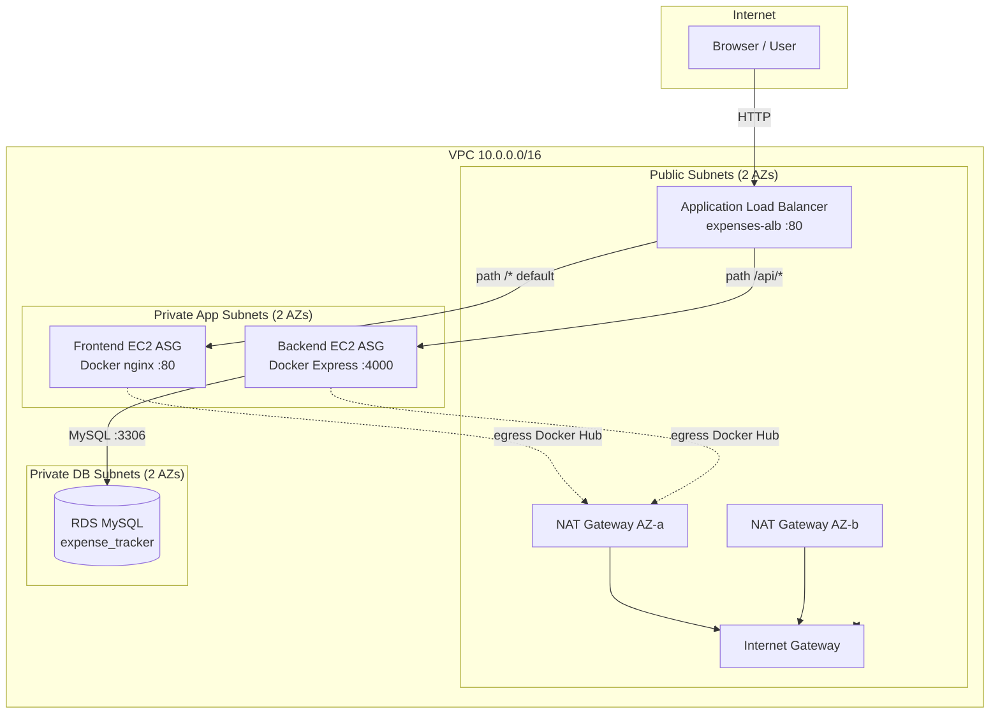
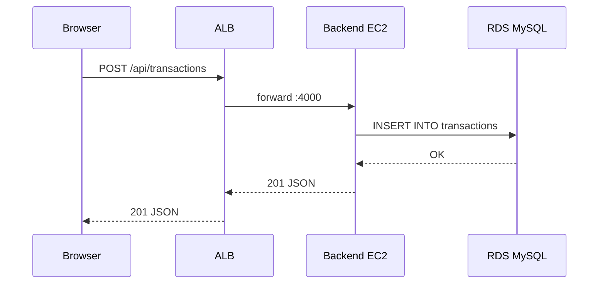
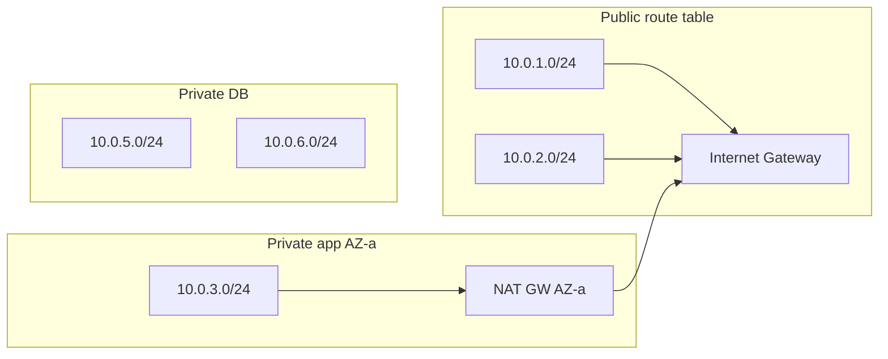
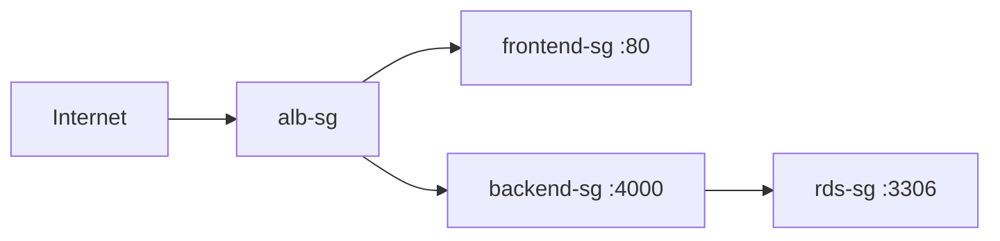

# Architecture

This document describes the **production-style 3-tier design** for the Expense Tracker on AWS: how traffic flows, how the VPC is segmented, and how manual deployment compares to Terraform.

---

## Table of Contents

1. [Design summary](#design-summary)
2. [High-level Mermaid diagram](#high-level-mermaid-diagram)
3. [Request flows](#request-flows)
4. [VPC and subnets](#vpc-and-subnets)
5. [Routing: IGW and NAT](#routing-igw-and-nat)
6. [Security groups](#security-groups)
7. [Load balancer routing](#load-balancer-routing)
8. [Compute and containers](#compute-and-containers)
9. [Database layer](#database-layer)
10. [Deployment methods compared](#deployment-methods-compared)

---

## Design summary

| Tier | Technology | AWS placement | Exposure |
|------|------------|---------------|----------|
| **Web** | React + Vite + nginx (Docker) | Private app subnets, Frontend ASG | Users reach via ALB only |
| **App** | Node.js + Express (Docker) | Private app subnets, Backend ASG | ALB path `/api/*` only |
| **Database** | Amazon RDS MySQL | Private DB subnets | Backend SG on port 3306 only |

**Single entry point:** Internet-facing Application Load Balancer (`expenses-alb`) in public subnets.

---

## High-level Mermaid diagram



---

## Request flows

### Important: API traffic does not pass through the frontend EC2

The React application runs in the **user's browser**. API calls go from the browser to the **same ALB hostname** under `/api/*`. The frontend EC2 only serves static HTML/JS/CSS.

### Flow A — Load the UI (`GET /`)

```
Internet → ALB (default listener) → Frontend target group :80 → nginx → React SPA
```

1. User opens `http://<alb-dns>/`.
2. ALB forwards to a healthy frontend instance.
3. nginx serves `index.html` and static assets.

### Flow B — API call (`GET /api/transactions`)

```
Internet → ALB (rule priority 100, path /api/*) → Backend target group :4000 → Express → RDS
```

1. Browser JavaScript calls `/api/transactions` (same origin as ALB when `VITE_API_URL` is empty).
2. ALB listener rule matches `/api/*` and forwards to backend instances.
3. Express queries MySQL and returns JSON.

### Flow C — First backend startup (schema bootstrap)

```
Backend container start → bootstrap.js → ping RDS → CREATE TABLE IF NOT EXISTS → Express listens :4000
```

No manual SQL required after `terraform apply`.

### Sequence diagram (API create transaction)



---

## VPC and subnets

Default layout (configurable in `terraform.tfvars`):

| Subnet resource | CIDR (default) | AZ | Route table | Workloads |
|-----------------|----------------|-----|-------------|-----------|
| `web_public_subnet_az1` | 10.0.1.0/24 | us-east-1a | Public → IGW | ALB, NAT |
| `web_public_subnet_az2` | 10.0.2.0/24 | us-east-1b | Public → IGW | ALB, NAT |
| `app_private_subnet_az1` | 10.0.3.0/24 | us-east-1a | Private → NAT (AZ-a) | Frontend + Backend ASG |
| `app_private_subnet_az2` | 10.0.4.0/24 | us-east-1b | Private → NAT (AZ-b) | Frontend + Backend ASG |
| `db_private_subnet_az1` | 10.0.5.0/24 | us-east-1a | Private DB (no internet) | RDS |
| `db_private_subnet_az2` | 10.0.6.0/24 | us-east-1b | Private DB (no internet) | RDS |

**Why frontend is in private app subnets:** Instances have no public IP. Only the ALB is internet-facing. Outbound pulls (Docker Hub) use NAT Gateways in public subnets.


---

## Routing: IGW and NAT

| Route table | Associated subnets | Default route |
|-------------|------------------|---------------|
| `public` | Web public (both AZs) | `0.0.0.0/0` → Internet Gateway |
| `private_az1` | App private AZ-a | `0.0.0.0/0` → NAT Gateway AZ-a |
| `private_az2` | App private AZ-b | `0.0.0.0/0` → NAT Gateway AZ-b |
| `private_db` | DB private (both AZs) | No internet route |



---

## Security groups

Terraform creates four security groups with least-privilege rules:

| SG | Inbound | Outbound |
|----|---------|----------|
| `alb-sg` | 80, 443 from `0.0.0.0/0` | All |
| `frontend-sg` | 80 from `alb-sg` | All |
| `backend-sg` | 4000 from `alb-sg` | All |
| `rds-sg` | 3306 from `backend-sg` | All |



No path from Internet → backend or Internet → RDS directly.

See [security-architecture.md](security-architecture.md) for extended threat-model notes.

---

## Load balancer routing

| Priority | Condition | Target | Health check |
|----------|-----------|--------|--------------|
| 100 | Path `/api/*` | `backend-tg` :4000 | `GET /health` |
| Default | All other paths | `frontend-tg` :80 | `GET /` |


---

## Compute and containers

| Component | Terraform resource | User data script |
|-----------|-------------------|------------------|
| Frontend ASG | `aws_autoscaling_group.frontend_asg` (`frontend-sg`) | `scripts/frontend.sh` |
| Backend ASG | `aws_autoscaling_group.backend_asg` (`backend-sg`) | `scripts/backend.sh` |

**On instance boot (user data):**

1. `apt update` + install Docker.
2. `docker pull` from Docker Hub (`rahul6364/expense-tracker-web` / `expense-tracker-api`).
3. `docker run` with published ports 80 or 4000.

Backend user data receives RDS endpoint and credentials via Terraform `templatefile`.

| Setting | Value |
|---------|-------|
| AMI | Ubuntu 22.04 LTS (data source) |
| Instance type | `t3.micro` |
| IAM | SSM Session Manager (`AmazonSSMManagedInstanceCore`) |

---

## Database layer

| Setting | Value |
|---------|-------|
| Identifier | `expense-tracker-db` |
| Engine | MySQL |
| Instance class | `db.t3.micro` |
| Database name | `expense_tracker` (created by RDS) |
| Table `transactions` | Created by `bootstrap.js` on API startup |
| Public access | No |
| Multi-AZ | No (lab configuration) |


---

## Deployment methods compared

| Aspect | Manual ([aws-setup.md](aws-setup.md)) | Terraform ([terraform-deployment.md](terraform-deployment.md)) |
|--------|--------------------------------------|----------------------------------------------------------------|
| Provisioning | AWS Console / CLI | `terraform apply` |
| Repeatability | Low | High |
| App install on EC2 | Manual user data / SSH | Automated `scripts/*.sh` |
| RDS credentials | Manual env vars | Injected via `templatefile` |
| Schema | Was manual SQL; now bootstrap | Automatic via bootstrap |
| Time to deploy | Hours (learning) | ~15–25 minutes |

Both approaches target the **same logical architecture** documented above.

---

## Related documentation

- [terraform-deployment.md](terraform-deployment.md)
- [aws-setup.md](aws-setup.md)
- [troubleshooting.md](troubleshooting.md)
- [README.md](README.md) — Documentation index and screenshot checklist
